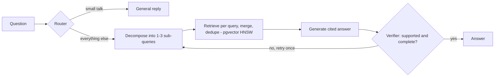

# Agentic RAG vs. Baseline RAG — Medicare Policy Assistant

A question-answering system over official Medicare policy documents, built to answer one question honestly: **does an agentic RAG pipeline actually beat a simple one?** On this corpus, measured over repeated trials, it did not, and this repo shows how that was established.

## Results

Hard evaluation set: 19 multi-document questions in everyday language + 5 unanswerable "trick" questions. Judge: GPT-4o. **Averages over 3 independent runs** (range in brackets).

| System | Accuracy | Completeness | Faithfulness | Refused unanswerable | Latency |
| --- | --- | --- | --- | --- | --- |
| Baseline RAG (single pass) | **80.7%** (79–84) | 54.4% (53–58) | **93.0%** (89–95) | 100% | **1.5s** |
| Agentic RAG (LangGraph, 5 nodes) | 75.4% (68–84) | **59.7%** (53–63) | 82.5% (79–84) | 100% | 6.2s |

**Takeaways**
- The baseline was more faithful in every run and 4x faster.
- The agent's completeness edge (about 1 question) is within run-to-run noise.
- The agent's accuracy varied widely between runs (68–84%): each extra LLM step adds variance.
- A single run can mislead: one run showed the agent ahead 84% to 74%, and the repeats showed that was noise.

## Architecture



The baseline skips everything except one retrieval (top 5 chunks) and one generation.

- **Corpus:** 6 public CMS documents (Medicare & You 2026, Medicare Benefit Policy Manual chapters 6, 8, 13, 15, 16) → 1,738 chunks (1,200 chars, 200 overlap)
- **Retrieval:** OpenAI `text-embedding-3-small`, Postgres + pgvector with an HNSW cosine index
- **Generation:** `gpt-4o-mini`, temperature 0, citations required
- **Serving:** FastAPI (`/ask`, `/ask/baseline`, `/health`)

## Evaluation method, and what I got wrong along the way

1. **Synthetic eval sets can be too easy.** A first set of 44 questions generated from single chunks scored 100% for both systems: questions reused the chunks' own wording, so one vector search always found them. I replaced it with harder questions: plain language, and needing two passages from different documents.
2. **The judge rewarded "I don't know".** It wasn't told which questions were answerable, so refusals on real questions counted as correct. Fixed by passing answerability to the judge.
3. **Faithfulness was tangled with correctness.** The judge saw the reference answer and marked answers that disagreed with it as "unfaithful". Fixed by grading faithfulness in a separate call that sees only the retrieved context.
4. **Some reference answers were wrong.** When both systems gave the same answer and both were marked wrong, the reference was usually at fault. 8 unreliable items were removed after review.
5. **A router bug.** Questions without the word "Medicare" were classified as off-topic. Fixed by defaulting to retrieval.
6. **Filtered vector search.** HNSW returns only the top 40 candidates before a `WHERE` filter is applied, so filtered queries could return nothing. Fixed with `SET hnsw.ef_search = 400`.

Results from each iteration are kept in `results/` (`v1_…`, `v2_…`, `v3_…`, `v4_run1-3`).

## Run it

```bash
git clone https://github.com/nihitha-i/agentic-rag.git && cd agentic-rag
python3.11 -m venv .venv && source .venv/bin/activate
pip install -r requirements.txt
cp .env.example .env          # add your OpenAI key
docker compose up -d db       # Postgres + pgvector
# put PDFs in data/ (see the corpus list above), then:
python -m app.ingest
python -m app.graph "Does Medicare cover hearing aids?"
uvicorn app.api:api --reload  # then open http://127.0.0.1:8000/docs
python -m eval.run_eval eval/questions_hard.jsonl
```

## Limitations and next steps

- 19 answerable questions is small: differences of 1–2 questions are within noise. Next: a larger, human-written test set.
- Try a cross-encoder reranker on the baseline, and decomposition without the verifier, to isolate which agent step hurts faithfulness.
- The LLM judge is itself a model; spot-check its grades against human judgment.

## Tech stack

Python · LangGraph · OpenAI API · PostgreSQL + pgvector (HNSW) · FastAPI · Docker · pandas
